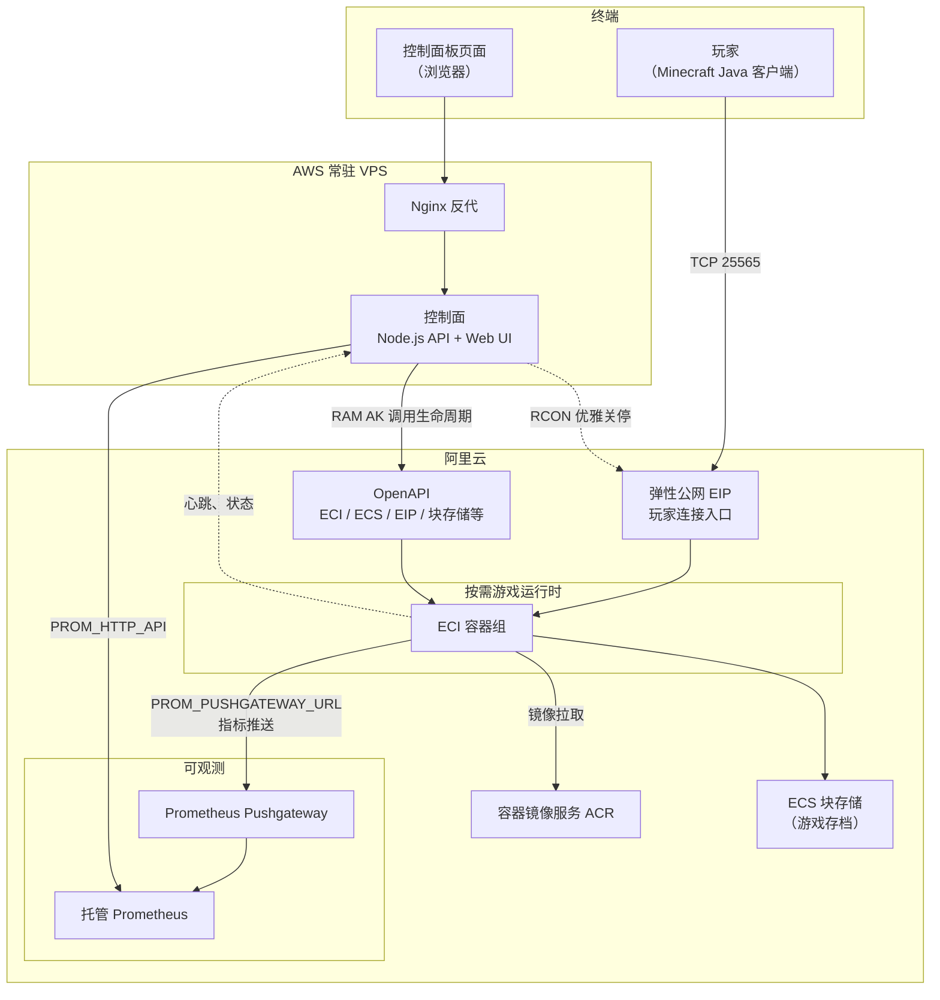

# 按需 Minecraft Server 控制面 — 系统架构

## 图例说明

- **控制面（VPS）**：常驻进程，通过 OpenAPI 创建/删除 ECI 或 ECS，读状态、预检；浏览器经 Token 访问 API/UI。
- **按需计算**：默认 **ECI** 起容器；**ECS** 为云盘分区等场景的备选。
- **ACR**：运行时镜像仓库；ECI/ECS 启动时拉取 `RUNTIME_IMAGE`。
- **EIP + 存储**：EIP 绑定到运行时供玩家域名解析；云盘/NAS 挂载为 `/data` 持久化。
- **Pushgateway + Prometheus**：容器内监控进程推送指标到 Pushgateway；托管 Prometheus 汇聚后，由**控制面服务端**拉查询 API 画图，浏览器不持有云监控 AK。
